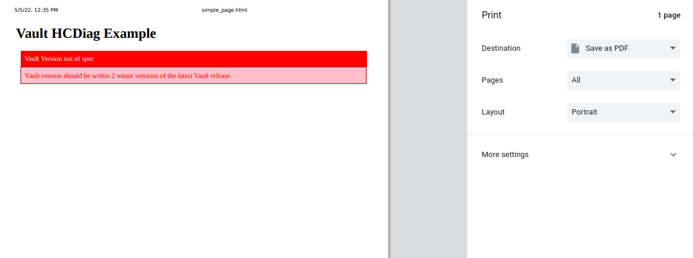

# hcdiagpy

This is meant as nothing more than a simple proof of concept for conversations.

## goal

The goal is to demonstrate something like a faster and more programmatic templating tool for hcdiag output.
This could be done in any language but I chose python for familiarity.
I feel like a better tool might be React or Svelte so that you could manipulate the DOM on-the-fly with text, formatting, etc directly in the browser.

## running

This is a python project built using poetry.
`poetry install` and the usual poetry workflow should work across all platforms.

## examples

Screenshots are taken inside of Chrome's Print feature (which could also be used with something like Print to PDF)

